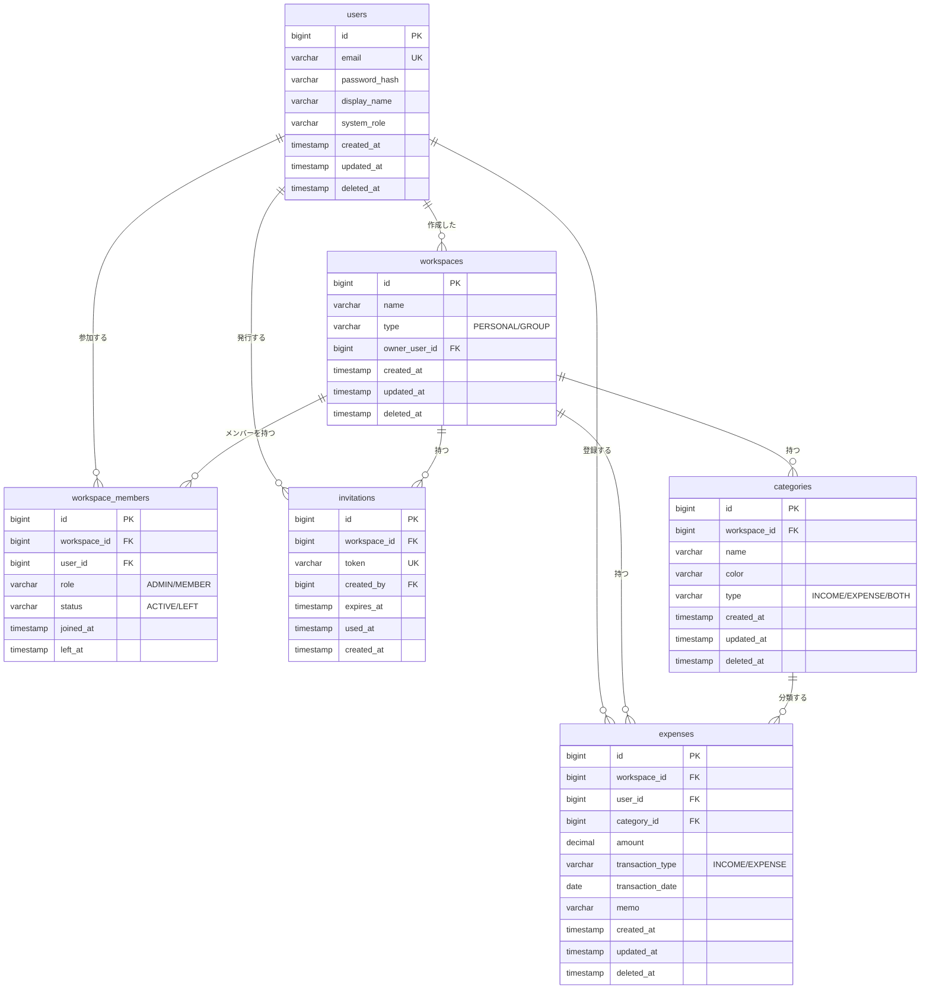

# 家計簿アプリ テーブル設計書

## 概要

V1機能要件をベースとした家計簿アプリのデータベース設計書です。
V2/V3への拡張も考慮した構成となっています。

### 設計方針

- **論理削除を採用**: 過去データとの整合性を保つため、原則として物理削除は行わない
- **ワークスペース概念で統一**: 個人用・グループ用を `workspaces` テーブルで一元管理
- **登録者の自動紐付け**: 収支データには登録者を必ず保持し、グループでの可視性を担保
- **集計はDB側で実行**: アプリ側での全件ループは避け、SQL の集計機能を活用

---

## テーブル一覧

| #   | テーブル名        | 役割                                       |
| --- | ----------------- | ------------------------------------------ |
| 1   | users             | ユーザー情報                               |
| 2   | workspaces        | ワークスペース（個人・グループ共通）       |
| 3   | workspace_members | ワークスペース所属メンバー（中間テーブル） |
| 4   | invitations       | グループ招待リンク                         |
| 5   | categories        | カテゴリ                                   |
| 6   | expenses          | 収支データ                                 |

---

## 1. users（ユーザー）

ユーザーアカウント情報を管理するテーブル。

| カラム名      | 型           | 制約                     | 説明                               |
| ------------- | ------------ | ------------------------ | ---------------------------------- |
| id            | BIGINT       | PK, AUTO_INCREMENT       | ユーザーID                         |
| email         | VARCHAR(255) | NOT NULL, UNIQUE         | メールアドレス                     |
| password_hash | VARCHAR(255) | NOT NULL                 | ハッシュ化されたパスワード         |
| display_name  | VARCHAR(100) | NULL                     | 表示名（NULL時はemail表示）        |
| system_role   | VARCHAR(20)  | NOT NULL, DEFAULT 'USER' | システムロール（'USER' / 'ADMIN'） |
| created_at    | TIMESTAMP    | NOT NULL                 | 作成日時                           |
| updated_at    | TIMESTAMP    | NOT NULL                 | 更新日時                           |
| deleted_at    | TIMESTAMP    | NULL                     | 論理削除日時                       |

**備考**
- `email` は論理削除済みアカウントとの重複に注意（部分インデックスや別カラム退避で対応）
- `system_role` の昇格は管理画面の専用APIからのみ可能とする
- パスワードは必ずハッシュ化して保存（bcrypt等）

---

## 2. workspaces（ワークスペース）

個人用・グループ用を統合した家計簿の単位。

| カラム名      | 型           | 制約                  | 説明                          |
| ------------- | ------------ | --------------------- | ----------------------------- |
| id            | BIGINT       | PK, AUTO_INCREMENT    | ワークスペースID              |
| name          | VARCHAR(100) | NOT NULL              | ワークスペース名              |
| type          | VARCHAR(20)  | NOT NULL              | 種別（'PERSONAL' / 'GROUP'）  |
| owner_user_id | BIGINT       | NOT NULL, FK→users.id | 作成者（GROUPの場合は管理者） |
| created_at    | TIMESTAMP    | NOT NULL              | 作成日時                      |
| updated_at    | TIMESTAMP    | NOT NULL              | 更新日時                      |
| deleted_at    | TIMESTAMP    | NULL                  | 論理削除日時（閉鎖日時）      |

**備考**
- ユーザー登録時に個人ワークスペース（type='PERSONAL'）を自動生成
- 個人ワークスペースは1ユーザー1個、グループは複数所属可能
- 個人ワークスペースの削除はユーザー退会時のみ
- グループワークスペースの削除（閉鎖）は管理者のみ可能

**CHECK制約**
```sql
CHECK (type IN ('PERSONAL', 'GROUP'))
```

---

## 3. workspace_members（ワークスペース所属メンバー）

ユーザーとワークスペースの多対多関係を解決する中間テーブル。

| カラム名     | 型          | 制約                       | 説明                                         |
| ------------ | ----------- | -------------------------- | -------------------------------------------- |
| id           | BIGINT      | PK, AUTO_INCREMENT         | ID                                           |
| workspace_id | BIGINT      | NOT NULL, FK→workspaces.id | ワークスペースID                             |
| user_id      | BIGINT      | NOT NULL, FK→users.id      | ユーザーID                                   |
| role         | VARCHAR(20) | NOT NULL                   | ワークスペース内ロール（'ADMIN' / 'MEMBER'） |
| status       | VARCHAR(20) | NOT NULL                   | 状態（'ACTIVE' / 'LEFT'）                    |
| joined_at    | TIMESTAMP   | NOT NULL                   | 初回参加日時                                 |
| left_at      | TIMESTAMP   | NULL                       | 直近の脱退日時                               |

**ユニーク制約**
```sql
UNIQUE (workspace_id, user_id)
```

**備考**
- 脱退時は `status='LEFT'` に更新（レコードは残す）
- 再参加時は既存レコードを `status='ACTIVE'` に更新（新規INSERTしない）
- `joined_at` は初回参加日を保持し続ける（再参加時も更新しない）
- 個人ワークスペースの作成者も本テーブルに登録される

**CHECK制約**
```sql
CHECK (role IN ('ADMIN', 'MEMBER'))
CHECK (status IN ('ACTIVE', 'LEFT'))
```

---

## 4. invitations（招待リンク）

グループへの招待リンクを管理するテーブル。

| カラム名     | 型           | 制約                       | 説明                   |
| ------------ | ------------ | -------------------------- | ---------------------- |
| id           | BIGINT       | PK, AUTO_INCREMENT         | ID                     |
| workspace_id | BIGINT       | NOT NULL, FK→workspaces.id | 招待先ワークスペース   |
| token        | VARCHAR(255) | NOT NULL, UNIQUE           | 招待トークン（UUID等） |
| created_by   | BIGINT       | NOT NULL, FK→users.id      | 発行者                 |
| expires_at   | TIMESTAMP    | NOT NULL                   | 有効期限               |
| used_at      | TIMESTAMP    | NULL                       | 使用日時               |
| created_at   | TIMESTAMP    | NOT NULL                   | 作成日時               |

**備考**
- `token` はUUID等の推測困難な値を使用
- 有効期限切れのリンクは無効として扱う
- 親ワークスペースが論理削除されたら、リンクも無効化する

---

## 5. categories（カテゴリ）

収支のカテゴリを管理するテーブル。ワークスペース単位で独立。

| カラム名     | 型          | 制約                       | 説明                                  |
| ------------ | ----------- | -------------------------- | ------------------------------------- |
| id           | BIGINT      | PK, AUTO_INCREMENT         | カテゴリID                            |
| workspace_id | BIGINT      | NOT NULL, FK→workspaces.id | 所属ワークスペース                    |
| name         | VARCHAR(50) | NOT NULL                   | カテゴリ名                            |
| color        | VARCHAR(7)  | NOT NULL                   | 表示色（#RRGGBB形式）                 |
| type         | VARCHAR(20) | NOT NULL                   | 用途（'INCOME' / 'EXPENSE' / 'BOTH'） |
| created_at   | TIMESTAMP   | NOT NULL                   | 作成日時                              |
| updated_at   | TIMESTAMP   | NOT NULL                   | 更新日時                              |
| deleted_at   | TIMESTAMP   | NULL                       | 論理削除日時                          |

**備考**
- ワークスペースごとに独立して管理（同じ名前のカテゴリが別WSに存在可能）
- 論理削除されたカテゴリは新規登録時の選択肢には表示しないが、過去データの参照は可能

**CHECK制約**
```sql
CHECK (type IN ('INCOME', 'EXPENSE', 'BOTH'))
```

---

## 6. expenses（収支データ）

家計簿の中核となる収支レコード。

| カラム名         | 型            | 制約                       | 説明                             |
| ---------------- | ------------- | -------------------------- | -------------------------------- |
| id               | BIGINT        | PK, AUTO_INCREMENT         | 収支ID                           |
| workspace_id     | BIGINT        | NOT NULL, FK→workspaces.id | 登録先ワークスペース             |
| user_id          | BIGINT        | NOT NULL, FK→users.id      | 登録者                           |
| category_id      | BIGINT        | NOT NULL, FK→categories.id | カテゴリ                         |
| amount           | DECIMAL(12,2) | NOT NULL                   | 金額（常に正の数）               |
| transaction_type | VARCHAR(10)   | NOT NULL                   | 収支区分（'INCOME' / 'EXPENSE'） |
| transaction_date | DATE          | NOT NULL                   | 取引日                           |
| memo             | VARCHAR(500)  | NULL                       | メモ                             |
| created_at       | TIMESTAMP     | NOT NULL                   | 作成日時                         |
| updated_at       | TIMESTAMP     | NOT NULL                   | 更新日時                         |
| deleted_at       | TIMESTAMP     | NULL                       | 論理削除日時                     |

**備考**
- `user_id` には登録時のカレントユーザーを自動セット
- `amount` は常に正の数（収支区分は `transaction_type` で表現）
- 集計クエリの効率化のため、後述のインデックスを推奨

**CHECK制約**
```sql
CHECK (transaction_type IN ('INCOME', 'EXPENSE'))
CHECK (amount >= 0)
```

---

## ER図



---

## インデックス設計（インデックスはv2以降で考慮）

主要クエリを基にした推奨インデックス。

### users
| インデックス   | カラム  | 用途                         |
| -------------- | ------- | ---------------------------- |
| uq_users_email | (email) | ログイン認証（UNIQUEで自動） |

### workspaces
| インデックス         | カラム          | 用途       |
| -------------------- | --------------- | ---------- |
| idx_workspaces_owner | (owner_user_id) | 所有者検索 |

### workspace_members
| インデックス                 | カラム                  | 用途                     |
| ---------------------------- | ----------------------- | ------------------------ |
| uq_members                   | (workspace_id, user_id) | 重複防止（UNIQUE）       |
| idx_members_user_status      | (user_id, status)       | ユーザーの所属WS一覧取得 |
| idx_members_workspace_status | (workspace_id, status)  | WSのメンバー一覧取得     |

### invitations
| インデックス              | カラム         | 用途                   |
| ------------------------- | -------------- | ---------------------- |
| uq_invitations_token      | (token)        | トークン検索（UNIQUE） |
| idx_invitations_workspace | (workspace_id) | WSの招待一覧           |

### categories
| インデックス             | カラム                     | 用途             |
| ------------------------ | -------------------------- | ---------------- |
| idx_categories_workspace | (workspace_id, deleted_at) | WS内カテゴリ一覧 |

### expenses（最重要）
| インデックス                    | カラム                           | 用途                     |
| ------------------------------- | -------------------------------- | ------------------------ |
| idx_expenses_workspace_date     | (workspace_id, transaction_date) | 月次履歴・集計           |
| idx_expenses_workspace_category | (workspace_id, category_id)      | カテゴリ別フィルタ・集計 |
| idx_expenses_workspace_user     | (workspace_id, user_id)          | 登録者別の絞り込み       |

---

## 設計上の重要ルール

### 論理削除のルール

1. すべての論理削除カラムは `deleted_at`（TIMESTAMP）で統一
   - 例外：`workspace_members` は脱退・再参加の概念があるため `status` + `left_at` を使用
2. 削除済みデータはアプリ層で `WHERE deleted_at IS NULL` を必ず付与して除外
3. 親が論理削除されても子データは触らない（参照だけ残す）
4. 復活機能はシステム管理者のみが利用可能

### ワークスペース削除のルール

| 種別       | 削除可能なユーザー     | 連動処理                 |
| ---------- | ---------------------- | ------------------------ |
| 個人WS     | 本人のみ（退会時連動） | ユーザー退会時に自動削除 |
| グループWS | 管理者のみ             | invitations も論理削除   |

削除後の挙動：
- 配下の categories / expenses / workspace_members は触らない
- カレントWSが削除された場合は個人WSにフォールバック

### メンバーの脱退・再参加

- 脱退時：`status='LEFT'`, `left_at=NOW()` に更新（レコード保持）
- 再参加時：既存レコードを `status='ACTIVE'`, `left_at=NULL` に更新
- `joined_at` は初回参加日を保持し続ける

### 権限管理

**システムロール**（users.system_role）
- USER：一般ユーザー
- SUPER_ADMIN：システム管理者（ユーザー管理、ワークスペース管理等）

**ワークスペースロール**（workspace_members.role）
- ADMIN：グループ管理者（招待リンク発行、WS設定変更）
- MEMBER：一般メンバー（収支登録・閲覧）

両ロールは独立しており、システム管理者であってもワークスペース内の権限は別管理。

---

## V2/V3への拡張余地

| 機能             | 必要なテーブル                               | 影響                         |
| ---------------- | -------------------------------------------- | ---------------------------- |
| 固定費・給与登録 | recurring_transactions（新規）               | 既存テーブルへの影響なし     |
| 予算管理         | budgets（新規）                              | 既存テーブルへの影響なし     |
| カレンダー表示   | （既存テーブルで対応可能）                   | インデックス追加程度         |
| 掲示板機能       | posts（新規）                                | workspace_id を持たせる      |
| アラート通知     | notifications, notification_settings（新規） | 既存テーブルへの影響なし     |
| 貯金目標         | savings_goals（新規）                        | workspace単位で管理可能      |
| 監査ログ         | admin_audit_logs（新規）                     | 管理画面の充実時             |
| 変更履歴         | expense_histories（新規）                    | 「誰がいつ編集したか」の追跡 |

---

## 未確定事項

| #   | 項目                         | 内容                                                |
| --- | ---------------------------- | --------------------------------------------------- |
| 1   | 招待リンクの使用回数         | 1回限り or 有効期限内なら複数人可                   |
| 2   | カレントWSの保持場所         | フロント保持 or サーバー保持                        |
| 3   | システム管理画面のV1実装範囲 | DBカラムのみ / API実装 / UI実装                     |
| 4   | 使用DB                       | PostgreSQL / MySQL 等（部分インデックス可否に影響） |
